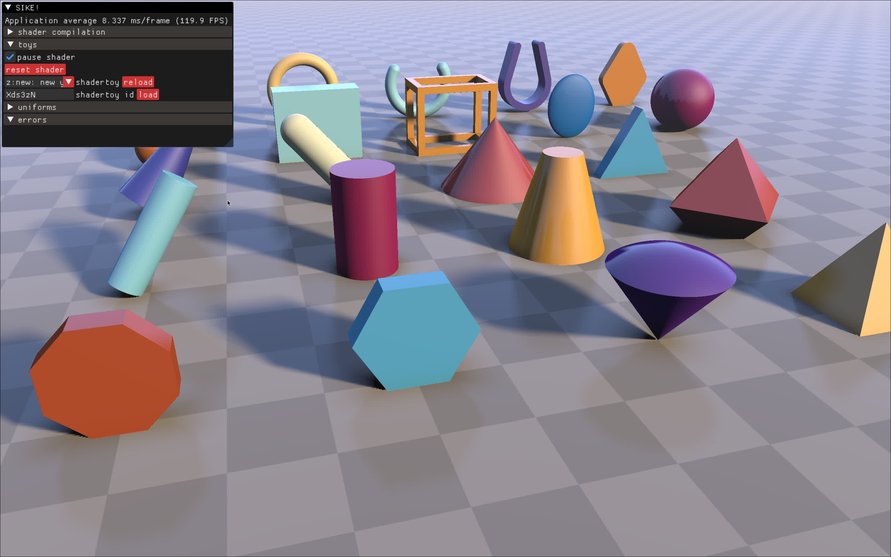

# Zhadertoy
Welcome to Zhadertoy! This is a shader playground inspired by Shadertoy, built to help me dive deeper into graphics programming. After working on projects like [fracGen_gpu](https://github.com/thrombe/fracGen_gpu) and [smoxel](https://github.com/thrombe/smoxel), I wanted a more flexible space for experimentation. My goal is to make a good and convenient shader playground that includes support for shadertoy shaders and does more when needed. so I can seamlessly port my earlier work and develop new ideas.

# Check Out a Simple Demo
Want to see it in action? Check out the demo on YouTube: [Zhadertoy Demo](https://youtu.be/zSm2gSjPpvM)

# Current Features
- Multi-pass Shadertoy shaders
- Easy download and setup for Shadertoy shaders
- Hot reloading shaders upon editing
- Ability to pause shaders

# Additional Info
Zhadertoy organizes shaders in the `./toys` directory. Shadertoy shaders are downloaded and stored in `./toys/shadertoy/[id]/`, with the active shader’s directory symlinked to `./shaders`. You can edit the files in `./shaders`, and they will be hot reloaded.

## File Structure
#### Editable Files:
`image.glsl`, `buffer*.glsl` (same as Shadertoy’s tabs)

#### Generated Files:
`frag.glsl`, `vert.glsl`, `generated_*.glsl`
These files contain code needed to run multiple shader passes, provide the correct inputs for shadertoy shaders and some glue code for compatibility between Vulkan GLSL (used by Zhadertoy) and OpenGL GLSL (used by Shadertoy). While not meant for direct editing, you can if you really want to.

## Render Order
The render order is as follows:
`buffer1.glsl` `buffer2.glsl` `buffer3.glsl` `buffer4.glsl` `image.glsl`

# Future Plans
I’ve got some ideas I’d love to implement:
- Shadertoy Compatibility
  - [ ] Sound pass
  - [ ] Keyboard channel
  - [ ] video channel
  - [ ] Cubemap pass
  - [ ] Editing channels/passes via GUI
- Non-Shadertoy Features
  - [ ] A more user-friendly way to specify passes, buffers, and textures in a config file
  - [ ] Utilities for creating Zig playground modules to manage passes and shaders
  - [ ] A dedicated config file for Zhadertoy

# Similar Projects
[desktop shadertoy](https://github.com/GabeRundlett/desktop-shadertoy)

Feel free to dig in, play around, and share your thoughts! Your feedback is always welcome.
A lot of shadertoy shaders should just work. though there might be a few missing overloads for functions on textures.
